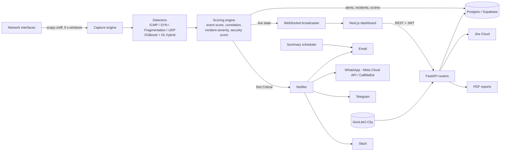
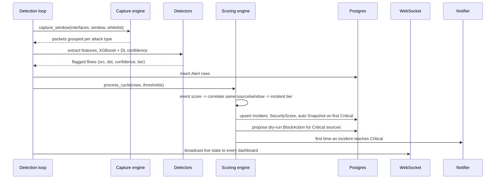

# Sentrix SOC Platform - Architecture

A real-time SOC console for DoS/flood detection. A FastAPI backend captures packets, scores them with
ML models, turns detections into incidents and pushes everything to a Next.js dashboard. Postgres
(Supabase) stores the state; email, WhatsApp, Telegram, Slack and Jira connect it to people.

## 1. System overview



Everything in the backend runs in **one process** (uvicorn). The detection loop, the summary scheduler
and the HTTP API share an asyncio event loop; packet sniffing runs in worker threads. The backend must
run with raw-capture privileges (Administrator on Windows with Npcap, root on Linux).

## 2. Detection pipeline (one cycle, default every 5 s)



- **Detectors** (`backend/app/detection/`): one module per attack type behind a registry. ICMP, SYN,
  fragmentation and UDP each load an XGBoost model, scaler and optional DL model from `app/models/<type>/`.
- **Scoring** (`backend/app/scoring/`): per-event severity, correlation of events from the same source
  and window into an incident, a combined Low/Medium/High/Critical tier, and a decayed 0-100 security score.
- **Whitelist and settings caches** keep thresholds and whitelisted IPs/networks/ports in memory so the
  loop never waits on the database for them.

## 3. Backend modules (`backend/app/`)

| Area | Files | Responsibility |
|---|---|---|
| Entry | `main.py` | FastAPI app, CORS, routers, startup: capture self-test, orphan cleanup, playbook seed, detection loop, summary scheduler |
| Capture | `capture/` | scapy sniffing per interface, privilege check, interface listing |
| Detection | `detection/` | per-attack detectors, model loading, the unified loop |
| Scoring | `scoring/` | event scoring, correlation, incident and aggregate scores |
| API | `api/` | alerts, incidents (scoring), playbooks, tickets, reports, metrics, settings, whitelist, snapshots, users, audit, block actions, auth, health |
| Auth | `auth/`, `api/auth.py` | bcrypt passwords, JWT, role checks, TOTP 2FA |
| Alerts | `notify.py`, `email_templates.py` | Critical alerts on every configured channel, HTML email design |
| Reports | `reports.py`, `summary.py` | PDF incident report, daily/weekly summary email |
| Integrations | `integrations/jira.py` | Jira Cloud REST client |
| Geo | `geoip.py` | MaxMind GeoLite2 lookups (city or country) |
| Realtime | `ws/` | WebSocket connection manager and live feed |
| Data | `db/` | SQLAlchemy async models and session |

## 4. Data model (Postgres)

| Table | Purpose |
|---|---|
| `users` | accounts, role (admin / analyst / viewer), analyst tier, TOTP secret + flag |
| `alerts` | every flagged flow with XGBoost / DL / hybrid confidence |
| `incidents` | correlated alerts: tier, impact, source IPs, workflow status, assignee, resolution |
| `incident_notes` | analyst notes (append-only) |
| `ticket_links` | Jira tickets per incident: key, URL, live status |
| `playbooks`, `incident_playbook_steps` | editable response playbooks and per-incident checklists |
| `block_actions` | dry-run block proposals and the analyst's decision |
| `security_scores`, `snapshots` | score history and point-in-time dashboard captures |
| `whitelist_entries`, `settings` | trusted sources and tunable thresholds |
| `false_positive_feedback` | labelled dataset for future retraining |
| `audit_log` | who did what, written in the same transaction as the change |

The schema lives in `supabase/schema.sql` (additive, re-runnable `create ... if not exists` statements).

## 5. Frontend (`frontend/`, Next.js 14, React, TypeScript)

| Page | What it does |
|---|---|
| Login | password step, then 6-digit code if 2FA is on |
| Overview, Live Traffic | live detection state over WebSocket |
| Incidents | queue, evidence, notes, tickets, block actions, playbook checklist, PDF download |
| Attack Map | live attacker pins on a world map (GeoLite2), preview mode with sample data |
| Tickets | all Jira tickets with live status, timeline and comments |
| Playbooks | create and edit response playbooks (admin) |
| Snapshots, Metrics, Health | history, KPIs (MTTA / MTTR, false positives), engine status |
| Whitelist, Settings | trusted sources and detection thresholds |
| Notifications | which alert channels are configured, send test messages, send summary email (admin) |
| Security | each user turns TOTP 2FA on or off |
| Users | accounts, roles, tiers, audit log, 2FA reset (admin) |

The dashboard talks to the backend over REST (JWT bearer token) and one authenticated WebSocket for the
live feed. The API base URL comes from `NEXT_PUBLIC_API_URL`.

## 6. Security model

- **Roles:** admin, analyst, viewer, enforced in the backend (`require_role`). Database row-level
  security is defence in depth only, because the backend connects directly to Postgres.
- **2FA:** TOTP. Login returns a short-lived "mfa" token that cannot be used as a session token; five wrong
  codes lock that user for five minutes; disabling needs password plus code; admins can reset it.
- **Audit:** role changes, incident updates, playbook steps, tickets, block decisions, report downloads,
  2FA changes and notification tests are written to `audit_log`.
- **Secrets** (database URL, JWT secret, SMTP, Meta / Jira tokens) live only in `backend/.env`, which is
  gitignored. Every outbound channel is optional and no-ops when unconfigured.
- **Safe by design:** block actions and ticketing never touch a real firewall; "execute" only records the decision.

## 7. Alerting and integrations

| Channel | Used for | Notes |
|---|---|---|
| Email (SMTP) | Critical alerts, summary email | HTML with severity banner, plain-text fallback |
| WhatsApp - Meta Cloud API | Critical alerts | per-severity templates `sentrix_alert_<tier>`; attack type, IPs, impact and a recommended action fill the variables |
| WhatsApp - CallMeBot | Critical alerts | free, unofficial alternative |
| Telegram, Slack, Twilio | Critical alerts | optional |
| Jira Cloud | tickets from incidents | create with editable form, live status, comments, one open ticket per incident |

Alerts fire once, the first time an incident reaches Critical.

## 8. Running it

```
backend/  python -m uvicorn app.main:app --host 0.0.0.0 --port 8000     (elevated, venv active)
frontend/ npm run dev                                                    (port 3000)
```

## 9. Known limits

- The detection loop has no automatic restart if it throws; check the uvicorn log.
- Each cycle can take longer than the 5 s capture window because model scoring is CPU-bound.
- Only Critical incidents trigger outside alerts today.
- The TOTP secret is stored unencrypted in the database.
- Meta's temporary WhatsApp token expires after about 24 hours (use a System User token for production).
